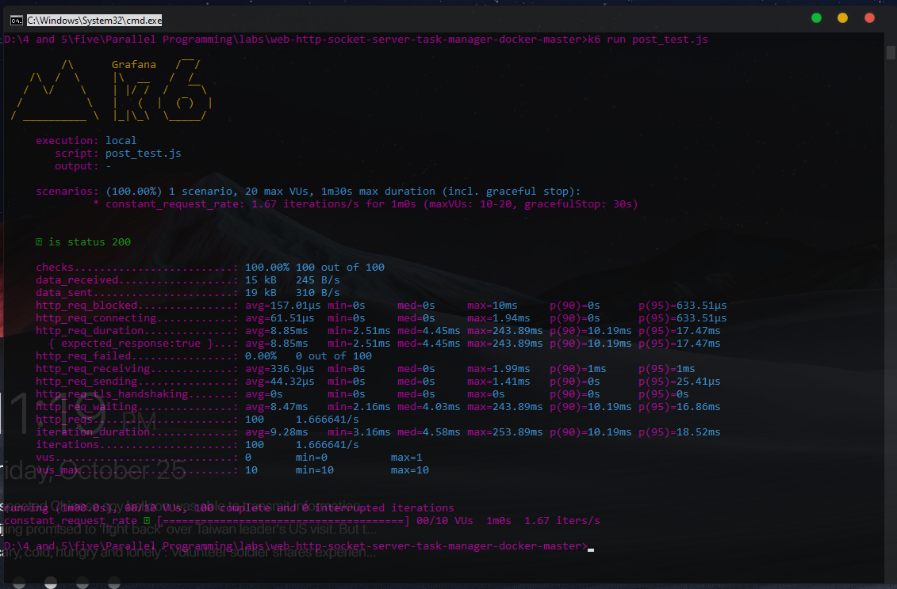
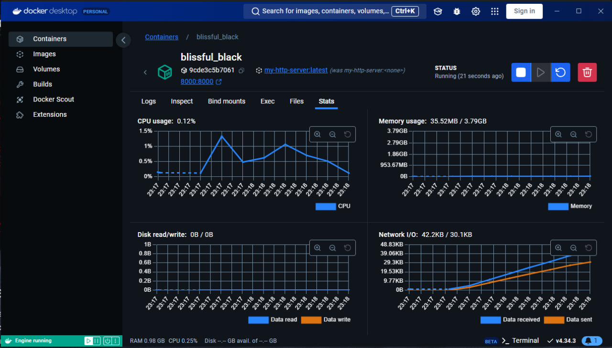

### Project Structure

```plaintext
web-http-socket-server-task-manager-docker-master/
├── .idea/
├── out/
├── src/
│   ├── handler/
│   │   ├── RequestsHandlerHttp.java
│   │   ├── RequestsHandlerSocket.java
│   ├── resources/
│   ├── singleton/
│   │   ├── TaskExecutor.java
│   │   ├── TasksList.java
│   ├── task/
│   │   ├── input.txt
│   │   ├── Task.java
│   │   ├── TaskBitcoin.java
│   │   ├── TaskBubbleSort.java
│   │   ├── TaskFiboRecursive.java
│   │   ├── TaskImpl.java
│   │   ├── TaskIncorrectParams.java
│   │   ├── TaskNotFound.java
│   │   ├── TaskWriteOnFile.java
│   ├── WebServerHttp.java
│   ├── WebServerSocket.java
```

### 1. Overview

This project is a web and socket-based server capable of handling various tasks such as Bitcoin calculation, sorting, recursive Fibonacci, and file writing tasks. It uses both HTTP and Socket protocols to receive requests and execute different tasks.

### 2. How to Build the Docker Image

1. **Build the Docker Image**:

   Open a terminal, navigate to the project directory, and run the following command to build the Docker image:

   ```bash
   docker build -t task-manager-server .
   ```

2. **Run the Docker Container**:

   Once the image is built, run the container with:

   ```bash
   docker run -p 8000:8000 task-manager-server
   ```

   This command will map port 8000 on your machine to port 8000 on the Docker container, allowing you to access the application at `http://localhost:8000`.

### 3. Using `k6` to Test `TaskWriteOnFile`

You can use [k6](https://k6.io/) to test the `TaskWriteOnFile` functionality, which is triggered via an HTTP `POST` request. Here’s how to set it up:

1. **Install `k6`**:

   - Download k6 from [k6.io](https://k6.io/docs/getting-started/installation/) and install it on your machine.

2. **Run the k6 Test**:

   To run the test, open a terminal and navigate to the directory where `post_test.js` (its in the project folder dirctly). Run the following command:

   ```bash
   k6 run post_test.js
   ```

   This will send a `POST` request to your server at `http://localhost:8000/` to trigger the `TaskWriteOnFile` task, simulating 10 virtual users over 1 minute.

---

3. **Run the k6 Stress Test**:

   To run the stress test, open a terminal and navigate to the directory where `stress_test.js` (its in the project folder dirctly). Run the following command:

   ```bash
   k6 run stress_test.js
   ```

4. **Run the k6 Spike Test**:

   To run the Spike test, open a terminal and navigate to the directory where `spiky.js` (its in the project folder dirctly). Run the following command:

   ```bash
   k6 run spiky.js
   ```




